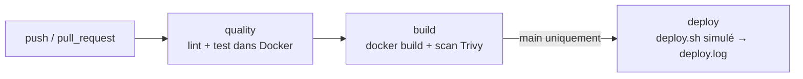

# SkillHub — CI/CD (EC06)

Dépôt : https://github.com/uishfaq/Skill-hub

Pipeline d'intégration et de déploiement continu pour une API Express (Node.js 20)
exposant un endpoint `GET /health`. L'objectif : industrialiser la livraison via
Git, Docker et GitHub Actions.


---

## 1. Workflow Git et Docker

### Stratégie de branches — Trunk-Based
- `main` : branche stable et **protégée** (ruleset GitHub : Pull Request obligatoire
  avant merge, pas de push direct).
- `feature/<nom>` : branches éphémères pour chaque tâche (ex. `feature/docker`,
  `feature/ci-bonus`), fusionnées dans `main` via Pull Request.

**Justification** : en contexte solo et cycle court, le Trunk-Based évite de maintenir
une branche `develop` intermédiaire tout en gardant l'exigence de revue via PR.

### Dockerfile multistage
- **Stage `builder`** (`node:20-alpine`) : `npm ci` complet (dépendances de dev
  incluant ESLint et Jest). C'est ce stage qu'utilise la CI pour lancer lint et tests.
- **Stage `runner`** (`node:20-alpine`) : `npm ci --omit=dev`, ne copie que `src/`,
  utilisateur non-root (`USER node`), `EXPOSE 3000`, `HEALTHCHECK` interrogeant
  `/health`. Image finale allégée (< 200 Mo).

### docker-compose
Trois services orchestrés (`docker compose up`) :
- `app` : build sur le stage `builder`, port 3000.
- `db` : MySQL 8, avec volume nommé pour la persistance.
- `phpmyadmin` : interface d'administration de la base (port 8080).

Variables chargées via `env_file: .env`, recréé depuis `.env.dist` (versionné).

---

## 2. Architecture du pipeline CI/CD

Workflow `.github/workflows/ci.yml`, déclenché sur `push` **et** `pull_request`.



- **quality** : `cp .env.dist .env`, puis `docker compose run --rm app npm run lint`
  et `npm test` — exécutés **dans Docker** pour valider la reproductibilité du compose.
  Rapport de tests publié en artefact.
- **build** : `docker build --target runner`, image taguée avec le SHA court du commit.
  Scan Trivy de l'image (CRITICAL/HIGH).
- **deploy** : déclenché **uniquement sur `main`**. Déploiement simulé via `deploy.sh`
  qui journalise les commandes et produit `deploy.log` en artefact.

---

## 3. Gestion des secrets

- **`.env` non versionné** : présent dans `.gitignore`, jamais commité. La CI le
  recrée à partir de `.env.dist` (valeurs factices, versionné) via `cp .env.dist .env`.
- **`GITHUB_TOKEN`** : fourni automatiquement par GitHub Actions, restreint au minimum
  via `permissions: contents: read`.
- **Aucun secret en clair** dans `ci.yml` ni dans les logs.
- **Scan d'image** : Trivy intégré en mode non-bloquant (`exit-code: 0`). Les CVE
  remontées proviennent de l'image de base `node:20-alpine`, non du code applicatif.
  En production, un seuil bloquant sur les CRITICAL serait défini avec une image
  durcie (distroless).

---

## 4. Instructions et limites

### Lancer en local
```bash
git clone https://github.com/uishfaq/Skill-hub.git
cd Skill-hub
cp .env.dist .env
docker compose up
```
- API : http://localhost:3000/health
- phpMyAdmin : http://localhost:8080


### Améliorations futures
- Publication de l'image sur ghcr.io (sur `main` uniquement).
- Déploiement réel via SSH ou PaaS (Render, Fly.io) avec GitHub Environments.
- Cache des dépendances npm, matrice de build multi-versions Node.
- Preview environments par PR, releases automatisées (tags sémantiques).

### Infos
J'ai laissé volontairement les branches `feature/ci-bonus` et `feature/docker` pour montrer l'évolution du projet. De plus, le fait d'être seul ma empecher de faire un vrai workflow Git avec des merges et des reviews, mais j'ai essayé de simuler au mieux le processus.